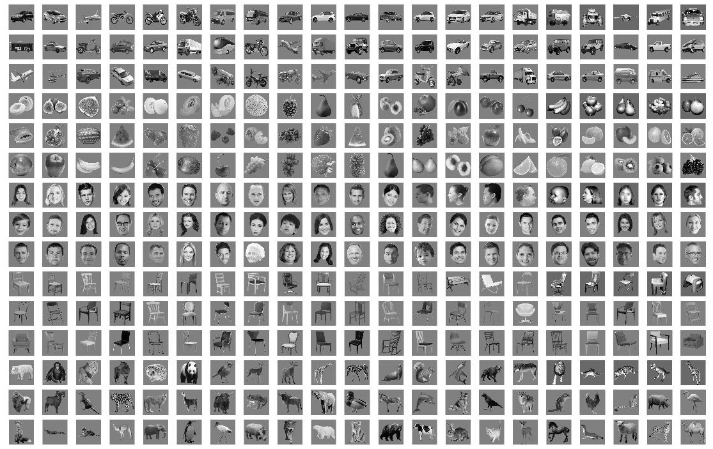
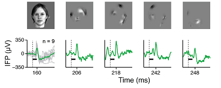

# Recurrent computations for visual pattern completion

Hanlin Tang, Martin Schrimpf, William Lotter, Charlotte Moerman, Ana Paredes, Josue Ortega Caro, Walter Hardesty, David Cox, Gabriel Kreiman
##### Kreiman Lab, http://klab.tch.harvard.edu


## Data
All the data can be found on this webpage: http://klab.tch.harvard.edu/resources/Tangetal_RecurrentComputations.html

*Stimuli*:
http://klab.tch.harvard.edu/resources/Tangetal_RecurrentComputations.html#stimuli


*Behavioral data*:
http://klab.tch.harvard.edu/resources/Tangetal_RecurrentComputations.html#psychophysics


*Neurophysiological data*:
http://klab.tch.harvard.edu/resources/Tangetal_RecurrentComputations.html#neurophysiology


*Additional figures*:
http://klab.tch.harvard.edu/resources/Tangetal_RecurrentComputations/WebFigures.pdf

## Models
All encoding models can be found here: https://github.com/kreimanlab/occlusion-models/tree/master/feature_extractors

The Hopfield network is implemented here: https://github.com/kreimanlab/occlusion-models/blob/master/feature_extractors/hopfield/HopFeatures.m

![Recurrent Models][http://klab.tch.harvard.edu/resources/images/Tangetal_RecurrentComputations_Logo.jpg]

Models are trained only on whole images and tested on occluded ones, posing a strong test of invariance.

## Setup
Clone this repository, making sure to also pull the models submodule:
`git clone --recurse-submodules https://github.com/kreimanlab/occlusion-classification.git`

To run everything, you will also need datasets which are too big for Github and can be found here: http://klab.tch.harvard.edu/resources/Tangetal_RecurrentComputations.html

## Sample runs
Creating inception features:
```bash
./run.sh rnn \
    "--model inceptionv3 
    --num_epochs 0 
    --features_directory ~/group/features/ 
    --input_features data_occlusion_klab325v2/images.mat 
    --whole_features klab325_orig/images.mat  
    --cross_validation objects 
    --num_timesteps 1"
```

Re-training Caffenet and creating features:
```bash
./run.sh rnn \
    "--model caffenet 
    --num_epochs 100  
    --features_directory ~/group/features/  
    --input_features data_occlusion_klab325v2/images.mat  
    --target_features data_occlusion_klab325v2/labels.mat  
    --whole_features klab325_orig/images.mat  
    --cross_validation objects"
```

Creating Hopfield features:
```bash
./run.sh features-hop \
    "'featureExtractors', NamedFeatures('resnet50'), 
    'trainDirectory', '~/group/features/klab325_orig/', 
    'testDirectory', '~/group/features/data_occlusion_klab325v2/', 
    'dataset', loadData('data/data_occlusion_klab325v2.mat', 'data')"
```

Training and predicting with SVM based on less-occlusion features:
```bash
./run.sh classification \
    "'featureExtractors', {NamedFeatures('features-inceptionv3_objects-t0')}, 
    'trainDirectory', '~/group/features/klab325_orig/', 
    'testDirectory', '~/group/features/data_occlusion_klab325v2'"
```

Plotting results:
```MATLAB
load('results.mat');
displayResults(results);
```
Plotting results with non-standard experimentData (usually data_occlusion_klab325v2.mat):
```MATLAB
load('results.mat');
load('experimentData.mat');
displayResults(results, data);
```


## Troubleshooting
### libsvm compilation fails on Linux
To resolve the error 
`cc1plus: error: unrecognized command line option "-std=c++11"`
when compiling libsvm inside Matlab, 
compile outside Matlab by typing `make matlab`.
